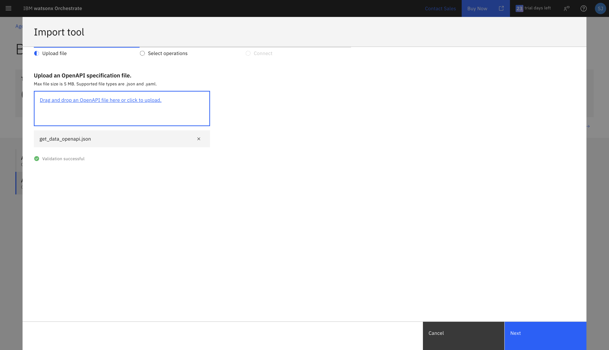

# Use case: Supervisor Assistant

## Table of Contents

- [Use case: Supervisor Assistant](#use-case-noc-supervisor-assistant)  
  - [Table of Contents](#table-of-contents)  
  - [Introduction](#introduction)  
    - [Pre-requisites](#pre-requisites)  
  - [Watsonx Orchestrate (SaaS)](#watsonx-orchestrate-saas)  
    - [Environment Setup](#environment-setup)  
    - [AI Agent Configuration](#ai-agent-configuration)  
    - [The Network Status Agent](#the-network-status-agent)  
    - [The Server Status Agent](#the-server-status-agent)  
    - [The Incident Diagnosis Agent](#the-incident-diagnosis-agent)  
    - [The Communications Agent](#the-communications-agent)  
    - [The Supervisor Agent](#the-noc-supervisor-agent)  
  - [Summary](#summary) 

## Introduction  

This use case describes a scenario where a Network Supervisor leverages an AI assistant through a natural language chat interface to investigate, diagnose, and resolve service disruptions. The assistant acts as a central routing point that selects the appropriate specialized agent to satisfy each request, ensuring rapid coordination across tools and knowledge sources.  

Agents can be configured in the system to address specific needs of the supervisor. Each agent is powered by a Large Language Model (LLM) with function-calling capabilities, enabling it to invoke the right tools or knowledge bases based on the task description.  

In our scenario, we will build agents for **Network Status**, **Server Status**, **Incident Diagnosis**, and **Communications**, all coordinated by a **Supervisor Agent**. This setup allows the Supervisor to ask questions in plain language, such as checking server health, investigating site-specific outages, diagnosing root causes, and drafting updates for field teams.  

There is an argument to be made that a truly agentic solution would demonstrate a high degree of autonomy. In such a setup, the system itself could monitor alerts, analyze logs, determine the root cause, generate a remediation plan, and notify stakeholders — all without human intervention. However, we can also maintain a **“human in the loop”** approach, where the Supervisor drives the workflow step by step, verifying outputs from each agent before proceeding to the next stage. This flexibility allows organizations to balance automation with oversight.  

<div style="border: 2px solid black; padding: 10px;">
Even though we will take you through a complete and working example, you should also consider making changes that fit your desired use case, and only take this description as a reference point that guides you along your own implementation.
</div>  

### Pre-requisites  

Before starting the lab, make sure you have the following installed and configured on your system:  

1. **Python 3.11**  
   - Download from [python.org](https://www.python.org/downloads/release/python-3110/).  
   - Verify installation:  
     ```bash
     python3 --version
     ```  

2. **Git**  
   - Download from [git-scm.com](https://git-scm.com/downloads).  
   - Verify installation:  
     ```bash
     git --version
     ```  

3. **Visual Studio Code (VS Code)**  
   - Download from [code.visualstudio.com](https://code.visualstudio.com/).  
   - Install recommended extensions:  
     - *Python* (for coding and debugging).  
     - *YAML* (for agent and tool configuration files).  

Once these prerequisites are installed, you will be ready to set up the environment and import agents into watsonx Orchestrate.  

- Check with your instructor to make sure **all systems** are up and running before you continue.  
- If you're an instructor running this lab, check the **Instructor's guides** to set up all environments and systems.  

## Watsonx Orchestrate (SaaS)

Watsonx Orchestrate (wxo) is IBM’s SaaS-based platform for creating, managing, and running AI-driven digital workers and agentic flows.  
In this bootcamp, you will use the SaaS version of Orchestrate to configure agents, tools, and knowledge sources directly from the web console, without needing to provision infrastructure yourself.  

Key concepts to keep in mind:  

- **Console Access**:  
  You will log into the Watsonx Orchestrate console using your IBMid. All agent testing and orchestration will happen here.  

- **Agents**:  
  Each agent encapsulates a role — for example, the *Network Status Agent* queries site/network health, while the *Incident Diagnosis Agent* analyzes logs and suggests root causes.  

- **Tools**:  
  Tools are Python or API-based functions that agents can call (e.g., checking server status or parsing network logs).  

- **Knowledge Sources**:  
  Data sources that provide structured domain-specific information through a vectore store (e.g., site network status data)

### Environment Setup

(Information about IBMid and cloud account)

#### Working Locally on the Repository

- Run the following command below to clone the repository. This will give you the foundational resources to complete the bootcamp.

```bash
  git clone https://github.com/Aditya-Asthana/ai-agentic-bootcamp-vz.git
```  

- Now open the project folder in vscode, and navigate to the terminal within the project directory.


- [Installing the ADK](https://developer.watson-orchestrate.ibm.com/getting_started/installing#setting-up-and-installing-the-adk): Once you the terminal appears on your screen, ensure you are in the folder where the contents of the repo live. Now type in the following commnads line by line:

```bash
  python3.11 -m venv bootcamp_venv
  source bootcamp_venv/bin/activate
  pip install ibm-watsonx-orchestrate
```  

Here, we are creating a virtual environment for our dependencies to live. This allows our agents to work in an isolated workspace with out the interference of other global Python libraries on your device. After, we install the SaaS version of Watsonx Orchestrate so we can import our future agents and tools through the CLI.

- Now we will rename our `.env_example` to `.env` through vscode. To do so, click on the pages icon on the left side and find the `.env_example` file. Right click on the file and rename it to `.env`. This will be a place where we store our credentials so that we can connect to Watsonx Orchestrate.

#### API Key

1. Go to the [IBM cloud console](https://cloud.ibm.com/) and ensure the right cloud account is selected through the dropdown. Check TechZone to confirm what cloud account you should be in.


2. Before we retrieve the API key, we have to create a project in watsonx.ai for our service to be assoicated with. Click the hamburger menu on the top left and click into resource list. After, click into the dropdown for **AI / Machine Learning**, and go to the linked instance of the watsonx.ai runtime. Once on the instance page, click the dropdown for **Launch in** and click `IBM watsonx`.


3. Scroll down to the **Projects** tab, and create a new project by clicking the **+** icon. then name the project `VZ WXO Bootcamp` and leave the rest of the settings the same. Click the blue **create project**. After, click the watsonx badge on the top left to go back to the home page.


4. Scroll up to the **Developer Access** tab and select your project in the project/deployment space dropdown. At the bottom of this section, click the button that says `Create API key +`. Name the key, and leave all the settings the same. Once you create the key, copy the key and paste it into your `.env` file. **It is incredibly important to save this key, as you can only see it on the watsonx console the one time!**

You are now setup to have an API key within watsonx. Next, we will get the Sevice Instance URL.

#### Service Instance URL

1. Go to the [IBM cloud console](https://cloud.ibm.com/) and ensure the right cloud account is selected through the dropdown. Check TechZone to confirm what cloud account you should be in.


2. Click the hamburger menu on the top left and click into resource list. After, click into the dropdown for **AI / Machine Learning**, and go to the linked instance of the watsonx Orchestrate. Once on the instance page, click  **Launch watsonx Orchestrate**.


3. Once you are in the watsonx Orchestrate console, click on your profile picture on the top right of your screen. Then, go to the settings tab. After, click into the API details and copy the `Service instace URL`. Go back to vscode, and paste this value into the vartiable `WO_INSTANCE`.


You now have all your credentials setup. The last thing left to do, is to setup your environment on orchestrate.

1. [Creating an environment](https://developer.watson-orchestrate.ibm.com/environment/initiate_environment#creating-an-environment): Go to vscode and open the terminal. Make sure you are in the directory inside the cloned repo. The use the command: `orchestrate env add -n <environment-name> -u <service-instance-url> --type ibm_iam --activate`. Replace the environment-name with a name of your choice, and the service-instance-url with the url from your env file. 

2. [Activating an environment](https://developer.watson-orchestrate.ibm.com/environment/initiate_environment#activating-an-environment): Now run `orchestrate env activate <environment-name>` and replace environment-name with the name you chose from before.

### AI Agent Configuration  

In this lab, we will configure a set of agents inside **watsonx Orchestrate (SaaS)**. Each agent plays a distinct role in the incident response workflow, while the **Supervisor Agent** coordinates them and routes requests appropriately.  

#### Network Status Agent  
- **Purpose**: Answers queries about the operational status of the network — including regions, sites, nodes, and active incidents.  
- **Tooling**: This agent connects to a **get_data tool** provided through an OpenAPI JSON file, enabling retrieval of up-to-date network data.  
- **Usage**: Handles queries like “What is the status of site S002?” or “Are there any ongoing outages in the Northeast region?”  

#### Communications Agent  
- **Purpose**: Drafts professional and concise email updates for internal or external stakeholders about incidents or operational changes.  
- **Tooling**: This agent integrates with **Outlook** using an imported **OpenAPI JSON tool**, which enables it to send notification emails automatically.  
- **Usage**: When the Supervisor requests an incident update for the “Los Angeles Verizon Network team,” this agent generates the email body and sends it through Outlook. 

#### Server Status Agent  
- **Purpose**: Verifies whether a specific server or URL is currently online and reachable.  
- **Tools**: Uses a server check tool to confirm availability.  
- **Usage**: Handles requests like “Check if verizon.com is up.”  

#### Incident Diagnosis Agent  
- **Purpose**: Analyzes incident logs, identifies the most likely **root cause**, and recommends a **resolution plan**.  
- **Tools**: Connects to a log analysis tool.  
- **Knowledge Sources**: Uses an incident resolution knowledge base for remediation steps.  
- **Output**: Always provides both the error type and the recommended resolution plan.  
 

#### Supervisor Agent  
- **Purpose**: Acts as the **routing agent**, interpreting user queries and delegating tasks to the right specialized agent.  
- **Collaborators**:  
  - **Network Status Agent** → for network/site health checks.  
  - **Server Status Agent** → for server reachability.  
  - **Incident Diagnosis Agent** → for log analysis and remediation.  
  - **Communications Agent** → for drafting and sending updates.  
- **User Experience**: Provides a natural language interface for the Supervisor, serving as the single entry point for all incident-related queries.  

---

Together, these agents form the backbone of the **Supervisor Assistant**. The Supervisor Agent orchestrates their interactions so that complex workflows (incident detection → diagnosis → remediation → communication) can be completed in a seamless conversational flow.

### Importing agents using the watsonx Orchestrate Console
**Accessing the console**: Navigate to the Watsonx Orchestrate home page. In the left-hand navigation menu, click on build to expand the menu and click on “Agent Builder”.


Agents depend on tools to perform their functions. When you define an agent, you specify which tools it can use in the tools section. The system needs the tools to exist before it can validate and import an agent that references them.

### The Network Status Agent

The **Network Status Agent** answers questions about network health (regions, sites, nodes, active incidents).  
In this lab, it **does not use a knowledge base**. Instead, it calls a `get_data` tool defined via an **OpenAPI JSON** so responses are fetched live from the source.

#### Import the OpenAPI tool (`get_data`)
This makes the `get_data` operation available for the agent to call.
Click on **All Tools → Create tool → Import an external tool → Upload the OpenAPI (wxo_assets/tools/get_data_openapi.json) → Select the "Get Data" operation → Done**




Verify you see an entry for `get_data` tool under the tools homepage.

> **WXO ADK CLI option:** You can import the OpenAPI tool from the ADK CLI by running the following commands in your terminal.
- Run: `orchestrate tools import -k openapi -f wxo_assets/tools/get_data_openapi.json`
- Verify: `orchestrate tools list` → you should see an entry for `get_data`

#### Import the Network Status Agent YAML
This registers the agent and binds its LLM instructions to the `get_data` tool.
Click on **All agents → Create Agent → Enter name and description for your agent → Create**


It is necessary to describe your agent, including its purpose to help other agents and tools know when to use it.


Scroll down to the toolset section and click on "Add Tool". Since we have already added the `get_data` tool to our local instance, we can select and add it to the agent.


- Run: `orchestrate agents import -f wxo_assets/agents/network_status_agent.yaml`
- Verify: `orchestrate agents list` → you should see `network_status_agent`

> **Console option (SaaS):** Go to **Agents → Add agent**, upload `wxo_assets/agents/network_status_agent.yaml`, then save.

####  Quick sanity checks
- Ask a scoped question (e.g., “What’s the status of site S002?”). The agent should call `get_data` behind the scenes.
- If responses look generic, confirm the tool name in the YAML matches the imported tool’s name exactly (`get_data`), and that the OpenAPI paths/servers are reachable.

####  Common troubleshooting tips
- **Tool not found:** Re-run `orchestrate tools list`. If missing, re-import `wxo_assets/tools/get_data_openapi.json`.
- **Name mismatch:** Ensure the tool name referenced in the agent YAML is exactly `get_data`.
- **Auth / endpoint issues:** If your OpenAPI requires auth or a specific base URL, verify those are set correctly in the OpenAPI JSON and accessible from Orchestrate (SaaS).

---

The **Network Status Agent** is ready. It will now route natural-language queries to the `get_data` tool to return live network status.

### The Server Status Agent

The **Server Status Agent** checks whether a given server or URL is reachable.  
This is useful for quickly validating if a service endpoint is online when an incident is reported.

#### 1) Import the Server Status Tool
This tool allows the agent to test HTTP/HTTPS endpoints and return whether they are up or down.

- Run: `orchestrate tools import -k python -f wxo_assets/tools/check_server_status_tool.py`  
- Verify: `orchestrate tools list` → you should see `check_server_status`

> **Console option (SaaS):** From the Orchestrate web console, navigate to **Tools → Add tool → Python**, then upload `wxo_assets/tools/check_server_status_tool.py`.

#### 2) Import the Server Status Agent YAML
This binds the **Server Status Agent** to the `check_server_status` tool you just imported.

- Run: `orchestrate agents import -f wxo_assets/agents/server_status_agent.yaml`  
- Verify: `orchestrate agents list` → you should see `server_status_agent`

> **Console option (SaaS):** Go to **Agents → Add agent**, upload `wxo_assets/agents/server_status_agent.yaml`, then save.

#### 3) Quick sanity checks
- Ask: “Check if verizon.com is up.”  
- The agent should call the `check_server_status` tool and return whether the server is reachable.  
- If no response or an error occurs, confirm the tool is present and correctly linked to the agent.

#### 4) Common troubleshooting tips
- **Tool not found:** Re-run `orchestrate tools list`. If `check_server_status` is missing, re-import it.  
- **Incorrect binding:** Verify that the agent YAML references `check_server_status` exactly as the tool name.  
- **Network restrictions:** Ensure the SaaS environment can reach the target server (some internal endpoints may be blocked).  

---

The **Server Status Agent** is now ready. It can be queried directly or invoked by the Supervisor Agent to check server availability in real time.

### The Incident Diagnosis Agent


The **Incident Diagnosis Agent** is responsible for analyzing incident logs, tagging them with the most likely root cause, and suggesting a resolution plan.  
It relies on a Python tool to parse logs and a knowledge base of resolution guides for remediation steps.

#### 1) Import the Incident Diagnosis Tool
This tool provides log analysis capabilities so the agent can extract error patterns and classify incidents.

- Run: `orchestrate tools import -k python -f wxo_assets/tools/diagnose_incident_tool.py`  
- Verify: `orchestrate tools list` → you should see `diagnose_incident_log`

> **Console option (SaaS):** From the Orchestrate web console, navigate to **Tools → Add tool → Python**, then upload `wxo_assets/tools/diagnose_incident_tool.py`.

#### 2) Import the Incident Resolution Knowledge Base
This knowledge base provides mappings from error types to recommended resolution plans. The agent consults it after the tool has identified the root cause.

- Run: `orchestrate knowledge-bases import -f wxo_assets/knowledge_bases/incident_resolution_guides.yaml`  
- Verify: `orchestrate knowledge-bases list` → you should see `incident_resolution_guides`

> **Console option (SaaS):** Go to **Knowledge Bases → Add knowledge base**, then upload `wxo_assets/knowledge_bases/incident_resolution_guides.yaml`.

#### 3) Import the Incident Diagnosis Agent YAML
This agent definition links the `diagnose_incident_log` tool with the `incident_resolution_guides` knowledge base and enforces a strict output format.

- Run: `orchestrate agents import -f wxo_assets/agents/incident_diagnosis_agent.yaml`  
- Verify: `orchestrate agents list` → you should see `incident_diagnosis_agent`

> **Console option (SaaS):** Go to **Agents → Add agent**, upload `wxo_assets/agents/incident_diagnosis_agent.yaml`, then save.

#### 4) Quick sanity checks
- Provide a sample log (e.g., containing a power outage error).  
- The agent should respond with both the **error type** and the **resolution plan**.  


#### 5) Common troubleshooting tips
- **Tool not found:** If missing, re-import `diagnose_incident_tool.py`.  
- **Knowledge base not linked:** Ensure `incident_resolution_guides` is visible in `orchestrate knowledge-bases list`.  
- **Format issues:** The agent always returns `error_type` and `resolution_plan`. If outputs look unstructured, confirm the YAML instructions are unchanged.  

---

 The **Incident Diagnosis Agent** is now ready. It can be invoked directly or through the Supervisor Agent to analyze logs and recommend remediation steps.


### The Communication Agent

The **Communications Agent** is responsible for drafting clear and professional notification emails about network incidents or operational updates.  
It integrates with **Outlook** using an OpenAPI JSON tool, allowing it not only to generate content but also to send emails automatically.

#### 1) Import the Outlook Email Tool
This tool provides the functionality for the agent to send messages through Outlook.

- Run: `orchestrate tools import -k openapi -f wxo_assets/tools/outlook_email_openapi.json`  
- Verify: `orchestrate tools list` → you should see `outlook_email`

> **Console option (SaaS):** In the Orchestrate console, navigate to **Tools → Add tool → OpenAPI**, then upload `wxo_assets/tools/outlook_email_openapi.json`.

#### 2) Configure Slack connection
The Slack connection enables authentication and provides the API endpoint required for the agent to send messages into Slack.

1. You will be provided with access to a Slack workspace: <insert_link_here>.
2. Create a new channel in this workspace. Use the following naming convention:  
   **agentic-ai-bootcamp-<YOUR_INITIALS><TWO_DIGITS>**  
   Example: `agentic-ai-bootcamp-aa82`
3. Open the newly created channel and click on the channel name at the top.
4. Navigate to **About** → scroll to the bottom → copy the **Channel ID**.
5. Open `communications_agent.yaml` and replace `{channel_id}` with the Channel ID from the previous step. Save your changes.

6. You will be provided with a **Bot OAuth User Token**. Keep this token ready for the next step.
7. Configure and set credentials for both **Draft** and **Live** environments.

**Draft environment**
```
# Configure connections
orchestrate connections configure -a slack_key_value_ibm_184bdbd3 --env draft --kind key_value --type team
orchestrate connections configure -a slack_bearer_ibm_184bdbd3 --env draft --kind key_value --type team

# Set credentials (replace <YOUR_TOKEN_HERE>)
orchestrate connections set-credentials -a slack_key_value_ibm_184bdbd3 --env draft -e base_url=https://slack.com/api
orchestrate connections set-credentials -a slack_bearer_ibm_184bdbd3 --env draft --token <YOUR_TOKEN_HERE>
```

**Live environment**
```
# Configure connections
orchestrate connections configure -a slack_key_value_ibm_184bdbd3 --env live --kind key_value --type team
orchestrate connections configure -a slack_bearer_ibm_184bdbd3 --env live --kind key_value --type team

# Set credentials (replace <YOUR_TOKEN_HERE>)
orchestrate connections set-credentials -a slack_key_value_ibm_184bdbd3 --env live -e base_url=https://slack.com/api
orchestrate connections set-credentials -a slack_bearer_ibm_184bdbd3 --env live --token <YOUR_TOKEN_HERE>
```

#### 3) Import the Communications Agent YAML
This agent definition links the Communications Agent with the `outlook_email` tool so it can both draft and send notifications.

- Run: `orchestrate agents import -f wxo_assets/agents/communications_agent.yaml`  
- Verify: `orchestrate agents list` → you should see `communications_agent`

> **Console option (SaaS):** Go to **Agents → Add agent**, upload `wxo_assets/agents/communications_agent.yaml`, then save.

#### 4) Quick sanity checks
- Ask the agent: “Draft an email update for the Los Angeles Verizon Network team about the incident being resolved.”  
- The agent should generate a professional email body.  
- If the Outlook tool is configured, you can also instruct it to send the email directly.

#### 5) Common troubleshooting tips
- **Tool not found:** If `outlook_email` is missing, re-import the OpenAPI JSON.  
- **Incorrect binding:** Make sure the agent YAML references the tool name `outlook_email`.  
- **Email not sending:** Verify the Outlook OpenAPI configuration includes the correct authentication and endpoints.  

---

 The **Communications Agent** is now ready. It can draft incident updates and, when configured with Outlook and Slack, send them directly to stakeholders.

### The Supervisor Agent

The **Supervisor Agent** acts as the routing brain for this use case. It interprets a user’s request and delegates the task to the correct specialist agent:
- **Network Status Agent** → network/site health questions  
- **Server Status Agent** → server/URL reachability  
- **Incident Diagnosis Agent** → log analysis and remediation recommendations  
- **Communications Agent** → drafting/sending stakeholder updates

This section wires up the Supervisor so it can orchestrate the end-to-end flow from detection → diagnosis → remediation → communication.

#### 0) Prerequisites (verify first)
Make sure these are already imported and visible:
- Tools: `get_data` (OpenAPI), `check_server_status` (Python), `diagnose_incident_log` (Python), and (optionally) `outlook_email` (OpenAPI)
  - Check with: `orchestrate tools list`
- Agents: `network_status_agent`, `server_status_agent`, `incident_diagnosis_agent`, `communications_agent`
  - Check with: `orchestrate agents list`

If anything is missing, complete those agent/tool steps first.

#### 1) Import the Supervisor Agent YAML
This registers the **Supervisor Agent** and declares its collaborators (the four specialist agents).

- Run: `orchestrate agents import -f wxo_assets/agents/supervisor_agent.yaml`  
- Verify: `orchestrate agents list` → you should see `supervisor_agent`

> **Console option (SaaS):** Go to **Agents → Add agent**, upload `wxo_assets/agents/supervisor_agent.yaml`, then save.

#### 2) Confirm collaborators (routing targets)
Open the agent details and confirm the collaborators include:
- `network_status_agent`
- `server_status_agent`
- `incident_diagnosis_agent`
- `communications_agent`

These must match the exact agent names you imported earlier. If names differ, update the Supervisor YAML or rename the agents for consistency.

#### 3) Quick sanity checks (routing behavior)
Try these natural-language prompts to validate routing:
- “**What’s the status of site S002?**” → should route to **Network Status Agent** (calls `get_data`)
- “**Check if verizon.com is up.**” → should route to **Server Status Agent** (calls `check_server_status`)
- “**Here’s an incident log… what’s the root cause and fix?**” → should route to **Incident Diagnosis Agent** (uses `diagnose_incident_log`, consults resolution guides if configured)
- “**Draft an email to the LA network team that the incident is resolved.**” → should route to **Communications Agent** (and can send via Outlook if configured)

#### 4) Common troubleshooting tips
- **Agent not found:** Re-run `orchestrate agents list`. If `supervisor_agent` is missing, re-import `wxo_assets/agents/supervisor_agent.yaml`.
- **Wrong route chosen:** Check the Supervisor’s instruction/routing rules. Ensure keywords in your test prompts align with the rules (e.g., “status/site/node/incident” → network status).
- **Tool call fails downstream:** Confirm the target specialist agent is correctly bound to its tool (e.g., `get_data`, `check_server_status`, `diagnose_incident_log`) and that the tool exists in `orchestrate tools list`.
- **Name mismatches:** The collaborator names in the Supervisor must match the registered agent names exactly.


#### 5) Bonus Challenge: Override the Default Greeting
By default, new agents start with “Hello! I am watsonx Orchestrate, an AI assistant, created by IBM. How can I help you today?”. You can override this in the Orchestrate Console. 

1. Go to the Orchestrate Console.
2. In the left-hand navigation (hamburger menu), go to Build → Agent Builder.
3. Click on `supervisor_agent` to view its details.
4. Edit the Agent Behavior in a way it says "Hello, I’m the Supervisor. I can help you check network and server status, diagnose incidents, or draft communications. How can I help you today?"
> Here are some things you may want to try: 
  > - Role clarity: Specify to the agent that it should clearly identify itself as the Supervisor.
  > - Task framing: Tell the agent to summarize the types of requests it can handle (network checks, incident diagnosis, communications).
  > - Override default: Make sure to instruct the agent to fully replace the standard watsonx greeting with this custom introduction.
  > - Constraints: Specify that the agent should not mention IBM or watsonx.
  > - Tone & personality: You can guide the agent to adopt a professional, supportive, concise, or friendly tone to make the greeting more engaging.

✅ The next time you start a chat, the agent should greet with your customized introduction instead of the default watsonx Orchestrate greeting.

---

The **Supervisor Agent** is now ready. It provides a single conversational entry point and automatically delegates tasks to the right agent, enabling an end-to-end incident flow.

### Bonus challenge 
### Bonus Use Case: HR Agent Lab  

As an optional exercise, you can explore the **HR Agent Lab**. This lab demonstrates how to build an agent that supports HR workflows, such as answering policy questions and coordinating employee-related tasks.  

A key feature of this lab is the use of the **Flow Builder** in watsonx Orchestrate. Flow Builder allows you to design and run multi-step workflows that sequence agents, tools, and even human approvals. This makes it possible to go beyond simple Q&A and create repeatable, automated HR processes. For example: pulling employee data, checking visa status, and providing managers with structured updates, all in one orchestrated flow.  

All the materials you need for this bonus lab are provided in the bootcamp repo:  
- The **HR Agent Lab - watsonx Orchestrate Irving PDF**  
- The **IBM_2025_Benefits_Guide PDF**  

You can find both files in the following folder:  
`wxo_assets/bonus_labs/hr_agent_lab/`  

This lab is entirely optional but recommended if you’d like to deepen your hands-on experience with agentic solutions, especially to see how **flows** can combine multiple agents and tools into end-to-end HR automation.


## Summary

In this lab, we explored the use case of a Supervisor managing network incidents with the help of an agentic AI solution. We began by creating specialized agents for network status checks, server availability, incident diagnosis, and stakeholder communications. Each agent was connected to the right tools and data sources — for example, the Network Status Agent used an OpenAPI tool to fetch live site data, while the Communications Agent leveraged Outlook integration to send updates.  

Finally, we brought everything together through the **Supervisor Agent**, which serves as the main conversational entry point. From this single interface, the Supervisor can ask natural language questions and the system will automatically route the request to the appropriate agent.  

This exercise provides a reference implementation to help you understand how multiple specialized agents can be orchestrated in **watsonx Orchestrate (SaaS)**. Some aspects are simulated, and in a production environment you would extend the integrations with real systems of record, monitoring platforms, and communication services. A truly agentic solution would go further by adding reasoning and planning capabilities, allowing the system to autonomously investigate, resolve, and communicate about incidents end-to-end.  

Our goal here is to give you a starting point and spark ideas about how to apply agentic AI in real operational contexts. With these foundations, you can begin experimenting with automating parts of your own workflows and consider where autonomous AI decision-making could add the most value.  
